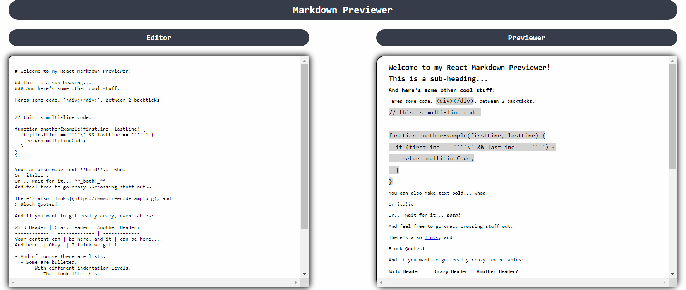

# Markdown Previewer

__See it here__: [markdown-previewer-reactjs-fcc.netlify.app](https://markdown-previewer-reactjs-fcc.netlify.app/)

Building this as the second project for the [freeCodeCamp.org Front End Development Libraries Certification](https://www.freecodecamp.org/learn/front-end-development-libraries/front-end-development-libraries-projects/build-a-markdown-previewer).

It takes in text input by the user following markdown syntax and renders it in actual processed HTML. 

## Technologies

- React
- CSS

### Libraries
- Marked
- DOMpurify

#### Project Diary

- __11/01/2022__
  - It took me about two hours to "complete" (it's never really finished, you just let it go...) the logic and make it functional. I've made use of the React Effect Hook for the first time in a project, as I have only just learned that at [School of Code](https://www.schoolofcode.co.uk/).
  - There are essentially two components: the editor and the previewer, although they are both rendered in the App component which gets, in turn, rendered on the HTML page.
  - I had to import the [Marked library](https://marked.js.org/) in order to parse the input text and also use the [dangerouslySetInnerHTML](https://reactjs.org/docs/dom-elements.html#dangerouslysetinnerhtml) attribute, which I wasn't familiar with.
  - Marked.JS recommends using a HTML sanitiser. To this purpose, I have imported DOMpurifier, but I have not implemented it yet.
- __14/01/2022__
  - App is functional and deployed on Netlify. I have tweaked the styling to make it more presentable, but did not go for anything sophisticated as I thought it would be unnecessary. Demo gif also updated.